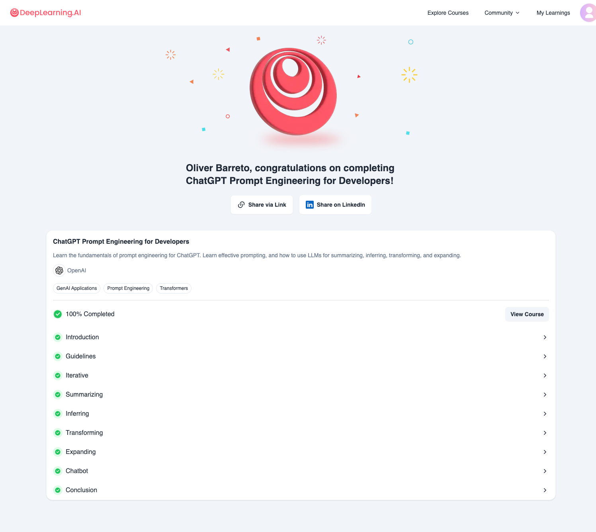

# Deeplearning.ai - Course Pprompt Engineering for developers
- Course Online:https://learn.deeplearning.ai/courses/chatgpt-prompt-eng/
- Git repo: deeplearning.ai.promptengineering
- Jupiter Notebooks of the course
- Finished: 15 diciembre 2024

# Course content:
  - Lesson 1 - Introduction
  - Lesson 2 - Guidelines
  - Lesson 3 - Iterative
  - Lesson 4 - Summarizing
  - Lesson 5 - Inferring
  - Lesson 6 - Transforming
  - Lesson 7 - Expanding
  - Lesson 8 - Chatbot
  - Lesson 9 - Conclusion

